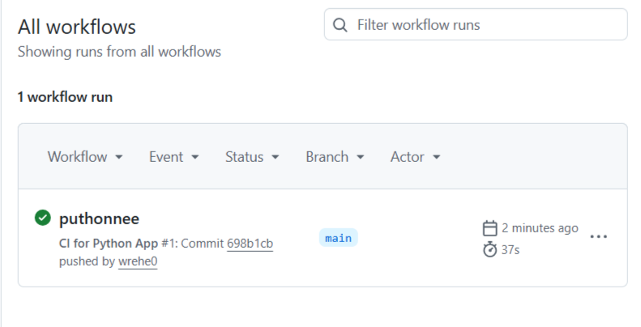
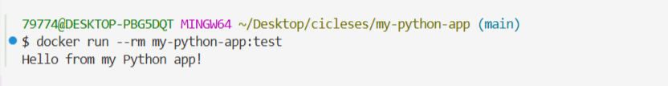

## Pipeline CI на Python в GitHub Actions

**Цель** — создать учебный пример **CI** для простого **Python**-приложения

Вы научитесь:
- Настроить **CI** для **Python** проектов
- Научиться контейнеризировать приложения с **Docker**
- Сборку Docker-образа
- Сохранение артефактов для локального использования

**CI (Continuous Integration - непрерывная интеграция)**

- Автоматически проверяет код при каждом **push/PR**:
- линтинг **(flake8)** - автоматическая проверка исходного кода
- тесты **(pytest)**
- сборка **Docker-образа** для проверки (без публикации)

### 1. Создайте на **GitHub** новый публичный репозиторий `my-python-app` с `README.md`

Склонируйте его себе, откройте в **VS Code** и создайте такую структуру будущего проекта:

Структура проекта
```
├── .github/
│   └── workflows/
│       └── ci.yml # GitHub Actions workflow
├── myapp/
│   ├── __init__.py # пустой файл
│   └── app.py # основной код
├── tests/
│   └── test_app.py # тесты (pytest)
├── requirements.txt # зависимости
├── setup.py
├── Dockerfile # для сборки образа
└── README.md # описание проекта
```

Структуру проекта можно сделать одной bash-командой, которая автоматически создаст всю структуру проекта:
```shell
mkdir -p .github/workflows myapp tests && touch .github/workflows/ci.yml myapp/{__init__.py,app.py} tests/test_app.py setup.py requirements.txt Dockerfile README.md
```

### 2. Файл `myapp/app.py`
```python
def add(a: int, b: int) -> int:
    """Возвращает сумму двух чисел."""
    return a + b

def main():
    print("Hello from my Python app!")

if __name__ == "__main__":
    main()
```

### 3. Файл `setup.py` для включения development mode
```python
# setup.py
from setuptools import setup, find_packages

setup(
    name="my-python-app",
    packages=find_packages(),
)
```

### 4. Файл `tests/test_app.py`
```python
from myapp.app import add

def test_add():
    assert add(2, 3) == 5
    assert add(-1, 1) == 0
    assert add(0, 0) == 0
```

### 5. Файл `requirements.txt`
```
pytest
flake8
```

### 6. Файл `Dockerfile`
```dockerfile
# Используем официальный образ Python
FROM python:3.11-slim
# Устанавливаем рабочую директорию
WORKDIR /app
# Копируем файл с зависимостями
COPY requirements.txt .
# Устанавливаем зависимости
RUN pip install --no-cache-dir -r requirements.txt
# Копируем весь проект
COPY . .
# Команда по умолчанию (запуск приложения)
CMD ["python", "myapp/app.py"]
```

### 7. Файл `.github/workflows/ci.yml`
```yaml
name: CI for Python App

on:
  push:
    branches: [ main, master ]
  pull_request:
    branches: [ main, master ]

jobs:
  test:
    name: Lint & Test
    runs-on: ubuntu-latest

    strategy:
      matrix:
        python-version: ["3.9", "3.10", "3.11", "3.12"]

    steps:
      - name: Checkout code
        uses: actions/checkout@v4

      - name: Set up Python ${{ matrix.python-version }}
        uses: actions/setup-python@v5
        with:
          python-version: ${{ matrix.python-version }}

      - name: Install dependencies
        run: |
          python -m pip install --upgrade pip
          pip install flake8 pytest
          if [ -f requirements.txt ]; then pip install -r requirements.txt; fi

      - name: Install package in development mode
        run: pip install -e .

      - name: Lint with flake8
        run: |
          flake8 . --count --select=E9,F63,F7,F82 --show-source --statistics
          flake8 . --count --exit-zero --max-complexity=10 --max-line-length=127 --statistics

      - name: Test with pytest
        run: pytest tests/

  docker-build:
    name: Build Docker Image (no push)
    runs-on: ubuntu-latest
    needs: test
    if: github.event_name == 'push' && github.ref == 'refs/heads/main'

    steps:
      - name: Checkout code
        uses: actions/checkout@v4

      - name: Build Docker image
        run: docker build -t my-python-app:test .
```

### 8. Проверить сборку онлайн

- Закоммитьте и запушите в ветку `main` эти файлы в ваш репозиторий
- Перейдите на вкладку **Actions** в вашем репозитории на **GitHub**. Вы увидите, как ваш **Workflow** запустился, а через несколько минут загорится **зеленая** галочка, которая означает, что все шаги прошли успешно
- Если ваш **Workflow** стал красным - исправьте ошибки и запуштесь снова



### 9. Проверить сборку Docker-образа локально

На своём компьютере, находясь в папке `my-python-app` этого репозитория выполнить:

Сборка проекта в Docker-образ
```shell
docker build -t my-python-app:test .
```
Создание и запуск контейнера:
```shell
docker run --rm my-python-app:test
```

Вы увидите вывод: `Hello from my Python app!`



Опционально вы можете зайти в созданный вами контейнер для ознакомления
```shell
docker run --rm -it my-python-app:test /bin/bash
```

> Если вы обнаружили ошибку в этом тексте - сообщите пожалуйста автору!